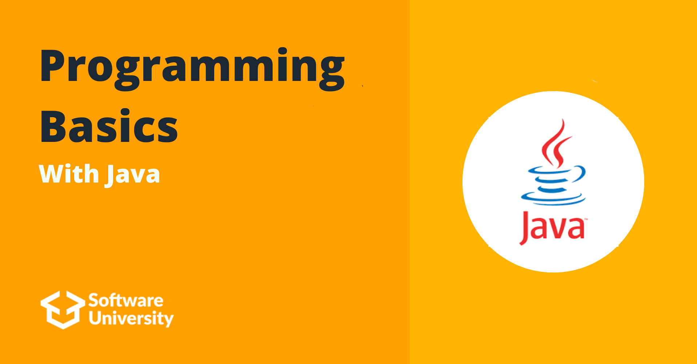

# Softuni Programming Basics With Java

## Intro
The Programming Basics was my first touch with programming. In this course I wrote my first program ("Hello World"), learned the most basic things like if-else statements, for and while loops.

To learn more about the course you can check [Softuni](https://softuni.bg/)

## Course topics
### Conditional Statements
- [Lab](https://github.com/DenisBuserski/SoftUni-Programming-Basics-Java/tree/main/Conditional_Statements_Lab)
- [Exercise](https://github.com/DenisBuserski/SoftUni-Programming-Basics-Java/tree/main/Conditional_Statements_Exercise)
- [More Exercise](https://github.com/DenisBuserski/SoftUni-Programming-Basics-Java/tree/main/Conditional_Statements_More_Exercises)
### Conditional Statements Advanced
- [Lab](https://github.com/DenisBuserski/SoftUni-Programming-Basics-Java/tree/main/Conditional_Statements_Advanced_Lab)
- [Exercise](https://github.com/DenisBuserski/SoftUni-Programming-Basics-Java/tree/main/Conditional_Statements_Advanced_Exercise)
### For Loop
- [Lab](https://github.com/DenisBuserski/SoftUni-Programming-Basics-Java/tree/main/For_Loop_Lab)
- [Exercise](https://github.com/DenisBuserski/SoftUni-Programming-Basics-Java/tree/main/For_Loop_Exercise)
- [More Exercise](https://github.com/DenisBuserski/SoftUni-Programming-Basics-Java/tree/main/For_Loop_More_Exercises)
### While Loop 
- [Lab](https://github.com/DenisBuserski/SoftUni-Programming-Basics-Java/tree/main/While_Loop_Lab)
- [Exercise](https://github.com/DenisBuserski/SoftUni-Programming-Basics-Java/tree/main/While_Loop_Exercise)
- [More Exercise](https://github.com/DenisBuserski/SoftUni-Programming-Basics-Java/tree/main/While_Loop_More_Exercises)
### Nested Loops
- [Lab](https://github.com/DenisBuserski/SoftUni-Programming-Basics-Java/tree/main/Nested_Loops_Lab)
- [Exercise](https://github.com/DenisBuserski/SoftUni-Programming-Basics-Java/tree/main/Nested_Loops_Exercise)
- [More Exercise](https://github.com/DenisBuserski/SoftUni-Programming-Basics-Java/tree/main/Nested_Loops_More_Exercises)

## Exams
- [Programming Basics Online Exam 6 And 7 July 2019](https://github.com/DenisBuserski/SoftUni-Programming-Basics-Java/tree/main/Programming_Basics_Online_Exam_6_And_7_July_2019)
- [Programming Basics Online Exam 6 And 7 April 2019](https://github.com/DenisBuserski/SoftUni-Programming-Basics-Java/tree/main/Programming_Basics_Online_Exam_6_And_7_April_2019)
- [Programming Basics Online Exam 28 And 29 March 2020](https://github.com/DenisBuserski/SoftUni-Programming-Basics-Java/tree/main/Programming_Basics_Online_Exam_28_And_29_March_2020)
- [Programming Basics Online Exam 20 And 21 April 2019](https://github.com/DenisBuserski/SoftUni-Programming-Basics-Java/tree/main/Programming_Basics_Online_Exam_20_And_21_April_2019)
- [Programming Basics Online Exam 19 And 20 December 2020](https://github.com/DenisBuserski/SoftUni-Programming-Basics-Java/tree/main/Programming_Basics_Online_Exam_19_And_20_December_2020)
- [Exam 09 2019](https://github.com/DenisBuserski/SoftUni-Programming-Basics-Java/tree/main/Exam_09_2019)

## Certificates
[Programming Basics Certificate](https://softuni.bg/certificates/details/93759/e23b453a)
